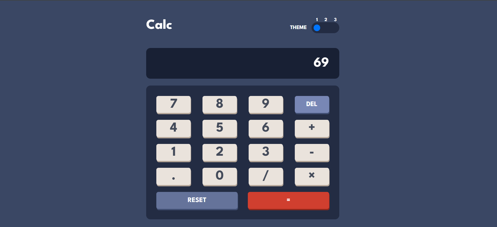
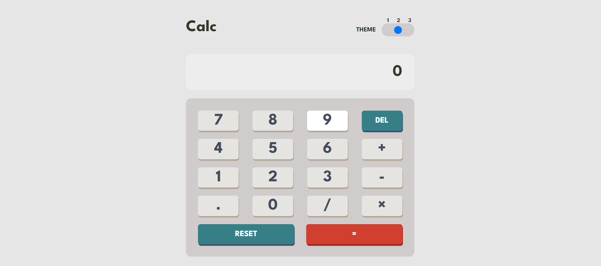
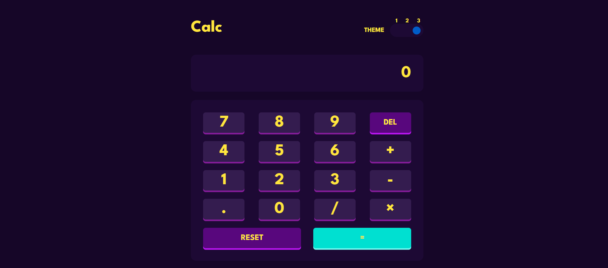

# Calculator App

A simple web calculator with themes.

## Table of contents

- [Overview](#overview)
  - [The challenge](#the-challenge)
  - [Features](#features)
  - [Screenshot](#screenshot)
  - [Links](#links)
- [My process](#my-process)
  - [Built with](#built-with)
  - [What I learned](#what-i-learned)
- [Author](#author)

## Overview

### The challenge

Users should be able to:

- See the size of the elements adjust based on their device's screen size
- Perform mathmatical operations like addition, subtraction, multiplication, and division
- Adjust the color theme based on their preference
- **Bonus**: Have their initial theme preference checked using `prefers-color-scheme` and have any additional changes saved in the browser

### Features

- Basic arithmetic operations (addition, subtraction, multiplication, division).
- Theme switching to customize the calculator's appearance.

### Screenshot

### Links

- Solution URL: (https://github.com/Neooo17/Calculator)
- Live Site URL: [Add live site URL here]()

## My process

### Built with

- Semantic HTML5 markup
- CSS custom properties
- Flexbox
- JavaScript

### What I learned

- Creating a responsive web calculator using HTML, CSS, and JavaScript.
- Implementing theme switching functionality with CSS classes and variables.
- Organizing CSS styles into separate files for better maintainability.
- Handling user interactions and performing basic arithmetic operations in JavaScript.
- Creating a README file to provide project documentation on GitHub.

## Author

- Website - [Neooo17]()
- Frontend Mentor - [@Neoo17]()

